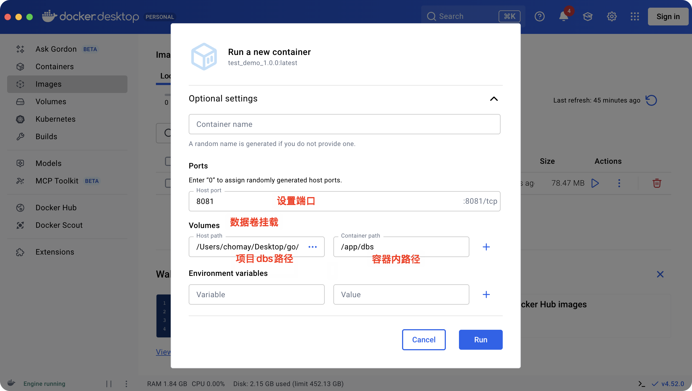

# Docker 构建与运行指南

本文档详细介绍了从零开始构建和运行本项目（test_demo）Docker 镜像的完整流程。

## 0. 基础概念说明 (FAQ)

**Q: Docker 是 Go 语言自带的吗？**
A: **不是。** Docker 和 Go 是两个完全独立的技术。
*   **Go (Golang)**: 是一种编程语言，用于编写我们的应用程序代码。
*   **Docker**: 是一种容器化平台，用于打包、分发和运行应用程序。

**Q: 为什么项目中不需要安装 Docker 相关的 Go 依赖？**
A: 因为 Docker 是一个**外部工具**，它运行在你的操作系统上（Mac, Windows, Linux），而不是你的 Go 代码里。
*   我们在项目中编写 `Dockerfile`，这只是一个文本配置文件。
*   你需要**在你的电脑上安装 Docker Desktop** (或 Docker Engine) 才能识别和运行 `docker build` 命令。
*   Go 项目本身（`go.mod`）不需要任何 Docker 的库，因为它只负责业务逻辑。Docker 负责把编译好的 Go 程序“包裹”起来运行。

---

## 1. 准备工作

在开始构建镜像之前，我们需要在项目根目录下创建两个关键文件：`Dockerfile` 和 `.dockerignore`。

### 1.1 创建 Dockerfile

`Dockerfile` 定义了镜像的构建过程。本项目采用多阶段构建（Multi-stage build）来减小最终镜像的体积。

请在项目根目录下创建一个名为 `Dockerfile` 的文件，并将以下内容复制进去：

```dockerfile
# 第一阶段：构建阶段
# 使用官方 Go 镜像作为构建环境，别名 builder
FROM golang:alpine AS builder

# 安装构建依赖
# 由于 go-sqlite3 库需要 CGO 支持（因为它包含 C 代码），
# 所以我们需要安装 gcc 和 musl-dev 编译器
RUN apk add --no-cache gcc musl-dev

WORKDIR /app

# 复制依赖定义文件
# 先只复制 go.mod 和 go.sum，这样如果依赖没有变化，
# Docker 可以利用缓存跳过下载步骤，加速构建
COPY go.mod go.sum ./

# 下载依赖
# 根据 go.mod 下载项目所需的所有依赖包
RUN go mod download

# 复制源代码
# 将当前目录下的所有源代码复制到容器的工作目录中
COPY . .

# 编译应用程序
# - CGO_ENABLED=1: 开启 CGO，这是使用 go-sqlite3 所必需的
# - GOOS=linux: 指定目标操作系统为 Linux
# - -o main: 指定输出的二进制文件名为 main
RUN CGO_ENABLED=1 GOOS=linux go build -o main .

# 第二阶段：运行阶段
# 使用轻量级的 Alpine Linux 作为最终运行环境，可以显著减小镜像体积
FROM alpine:latest

WORKDIR /app

# 安装运行时依赖
# 安装 ca-certificates 证书库，防止应用发起 HTTPS 请求时报错
# --no-cache 表示不缓存索引，减小镜像体积
RUN apk add --no-cache ca-certificates

# 复制二进制文件
# 从 builder 阶段（第一阶段）复制编译好的二进制文件到当前镜像中
COPY --from=builder /app/main .

# 创建数据库目录
# 预先创建 dbs 目录，用于存放 SQLite 数据库文件
# 建议运行时挂载此目录以持久化数据
RUN mkdir -p dbs

# 暴露端口
# 声明容器运行时监听的端口，方便阅读和映射
EXPOSE 8081

# 启动命令
# 容器启动时默认执行的命令
CMD ["./main"]
```

### 1.2 创建 .dockerignore

`.dockerignore` 文件的作用类似于 `.gitignore`，它告诉 Docker 在构建镜像时忽略哪些文件。这可以避免将不必要的文件（如本地数据库、IDE 配置、文档等）复制到镜像中，从而减小镜像体积并加快构建速度。

请在项目根目录下创建一个名为 `.dockerignore` 的文件，并将以下内容复制进去：

```gitignore
# Git 版本控制文件
.git
.gitignore

# IDE 和编辑器配置文件
.idea
.vscode
.DS_Store

# 本地数据库文件 (避免将本地测试数据打包进镜像)
dbs/*.db

# 文档文件 (构建应用不需要这些)
a-docs
*.md

# Docker 相关文件
Dockerfile
.dockerignore
```

## 2. 构建 Docker 镜像
记得先安装Docker桌面端:https://www.docker.com/products/docker-desktop
当然也可以通过brew安装:brew install --cask docker

准备工作完成后，在项目根目录下执行以下命令来构建 Docker 镜像。我们将镜像命名为 `test_demo_1.0.0`。

```bash
docker build -t test_demo_1.0.0 .
```

*   `-t test_demo_1.0.0`: 指定镜像名称为 `test_demo`，标签（版本）为 `1.0.0`。
*   `.`: 指定构建上下文为当前目录。Docker 会将该目录下的所有文件（除了 `.dockerignore` 排除的）发送给 Docker 守护进程用于构建。

### 2.1 指定 Dockerfile 路径或构建上下文 (进阶)

如果你不在项目根目录下，或者 Dockerfile 文件名不是默认的 `Dockerfile`，你可以指定路径：

**场景 1：在其他目录构建**
假设你在上一级目录，想构建 `1_test_demo` 项目：
```bash
docker build -t test_demo_1.0.0 ./1_test_demo
```
这里 `1_test_demo` 就是构建上下文路径。

**场景 2：指定 Dockerfile 路径**
如果你的 Dockerfile 放在 `build/Dockerfile`，或者名字叫 `Dockerfile.dev`：
```bash
# 使用 -f 参数指定 Dockerfile 路径
docker build -t test_demo_1.0.0 -f build/Dockerfile .
```
或者
```bash
docker build -t test_demo_1.0.0 -f Dockerfile.dev .
```
注意：最后的 `.` 仍然代表构建上下文是当前目录。

构建过程可能会花费一些时间，因为需要下载依赖并编译 Go 代码。

构建完成后，通过命令`docker images`查看镜像列表，可以看到新构建的镜像。输出示例：

```bash
IMAGE                    ID             DISK USAGE   CONTENT SIZE   EXTRA
test_demo_1.0.0:latest   54eb53f2cc50       78.5MB         24.9MB   
```

## 3. 运行 Docker 容器

### 方式1 终端命令：

```bash
docker run -p 8081:8081 --name test_demo_app test_demo_1.0.0
```
   - `-p 8081:8081`: 将容器的 8081 端口映射到宿主机的 8081 端口。
   - `--name test_demo_app`: 给容器起一个名字，方便后续管理。

### 方式2 Docker Desktop GUI：
  - 构建完Docker镜像后，Docker Desktop 会自动在Images中显示
  - 点击 `Run` 按钮后，会弹框提示，
    - 记得端口输入：8081
    - Volumes中设置数据卷挂载，也就是通过docker run命令中的-v参数， `host path：/Users/chomay/Desktop/go/1_test_demo/dbs`、`container path：app/dbs`
  

## 4. 数据持久化 (强烈推荐)

本项目使用 SQLite 数据库，默认存储在容器内的 `dbs/test.db`。如果删除容器，数据将会丢失。为了持久化数据，建议将宿主机的目录挂载到容器中。

```bash
# 假设你在项目根目录下运行
docker run -p 8081:8081 \
  -v $(pwd)/dbs:/app/dbs \
  --name test_demo_app \
  test_demo_1.0.0
```

`-v $(pwd)/dbs:/app/dbs`: 将当前目录下的 `dbs` 文件夹挂载到容器的 `/app/dbs` 目录。这样，数据库文件实际上是存储在你的宿主机上的，即使容器被删除，数据依然存在。

`-v 宿主机路径:容器内路径`
`/app/dbs`: 容器内路径

- `$(pwd)/dbs`: 宿主机路径（你的Mac）,实际值：Users/chomay/Desktop/go/1_test_demo/dbs

通过设置-v参数后，镜像中的dbs目录和宿主机的dbs目录就建立了同步联系，数据会自动同步到宿主机(本项目)的dbs目录中。

## 5. 环境变量配置(可以先忽略)

项目支持通过环境变量 `DB_DSN` 配置数据库路径。如果你想改变数据库文件的位置或名称，可以在运行时传递环境变量：

```bash
docker run -p 8081:8081 \
  -e DB_DSN="dbs/my_custom.db" \
  -v $(pwd)/dbs:/app/dbs \
  test_demo_1.0.0
```

*   `-e DB_DSN="dbs/my_custom.db"`: 设置环境变量 `DB_DSN`，覆盖程序默认的数据库路径。

## 6. 常用 Docker 命令

*   **查看正在运行的容器**:
    ```bash
    docker ps
    ```

*   **停止容器**:
    ```bash
    docker stop test_demo_app
    ```

*   **启动已停止的容器**:
    ```bash
    docker start test_demo_app
    ```

*   **删除容器** (需要先停止):
    ```bash
    docker rm test_demo_app
    ```

*   **删除镜像**:
    ```bash
    docker rmi test_demo_1.0.0
    ```

## 7. 上传镜像到 Docker Hub

如果你想将构建好的镜像分享到 Docker Hub，可以按照以下步骤操作：

### 7.1 登录 Docker Hub

首先需要登录到你的 Docker Hub 账号：

```bash
docker login
```

系统会提示输入用户名和密码。如果已经登录过，会显示 "Login Succeeded"。

### 7.2 给镜像打标签

Docker Hub 的镜像命名规范是：`用户名/仓库名:版本号`

将本地镜像重新打标签：

```bash
docker tag test_demo_1.0.0:latest chomay/test_demo:1.0.0
```

*   `test_demo_1.0.0:latest`: 本地镜像名称
*   `chomay/test_demo:1.0.0`: Docker Hub 镜像名称
    *   `chomay`: 你的 Docker Hub 用户名
    *   `test_demo`: 仓库名称
    *   `1.0.0`: 版本标签

如果想同时推送 `latest` 标签，可以再打一个标签：

```bash
docker tag test_demo_1.0.0:latest chomay/test_demo:latest
```

### 7.3 推送镜像到 Docker Hub

```bash
docker push chomay/test_demo:1.0.0
```

如果你也打了 `latest` 标签，也需要推送：

```bash
docker push chomay/test_demo:latest
```

推送完成后，你可以在 Docker Hub 上查看你的镜像：
`https://hub.docker.com/r/chomay/test_demo`

### 7.4 其他用户如何使用你的镜像

其他用户可以直接拉取并运行你的镜像：

```bash
# 拉取镜像
docker pull chomay/test_demo:1.0.0

# 运行容器
docker run -p 8081:8081 --name test_demo_app chomay/test_demo:1.0.0
```

### 7.5 查看本地镜像标签

查看所有相关镜像：

```bash
docker images | grep test_demo
```

输出示例：
```
chomay/test_demo         1.0.0    54eb53f2cc50   78.5MB
chomay/test_demo         latest   54eb53f2cc50   78.5MB
test_demo_1.0.0          latest   54eb53f2cc50   78.5MB
```
